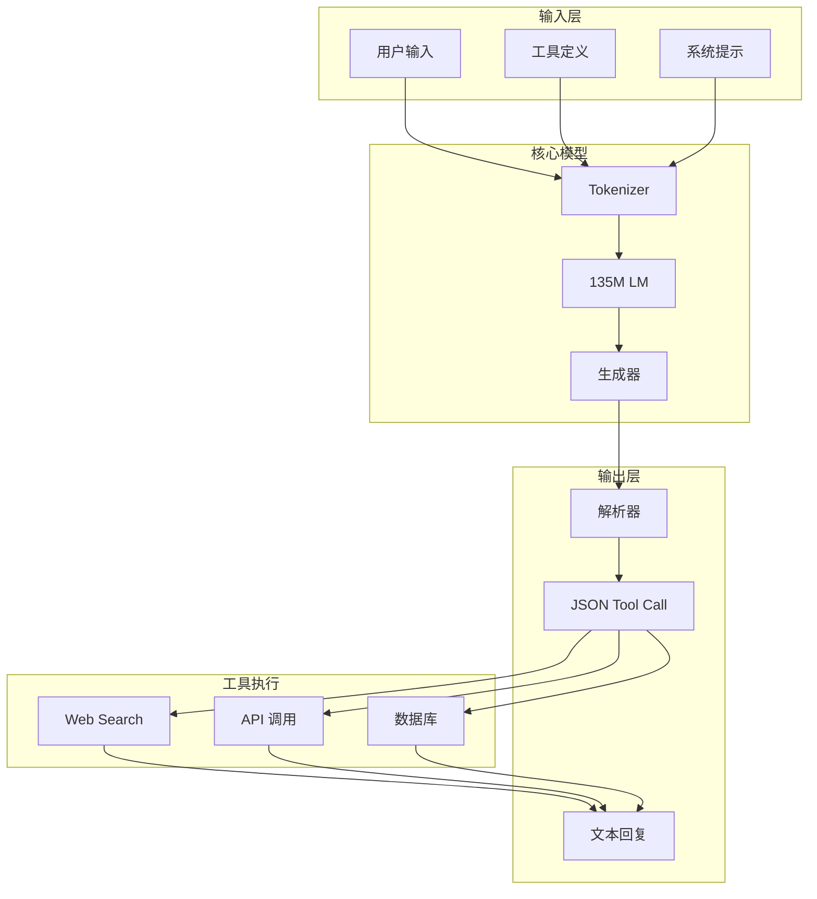
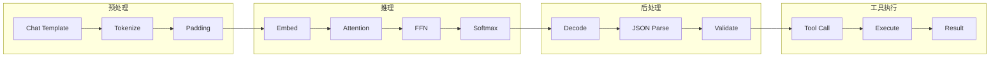
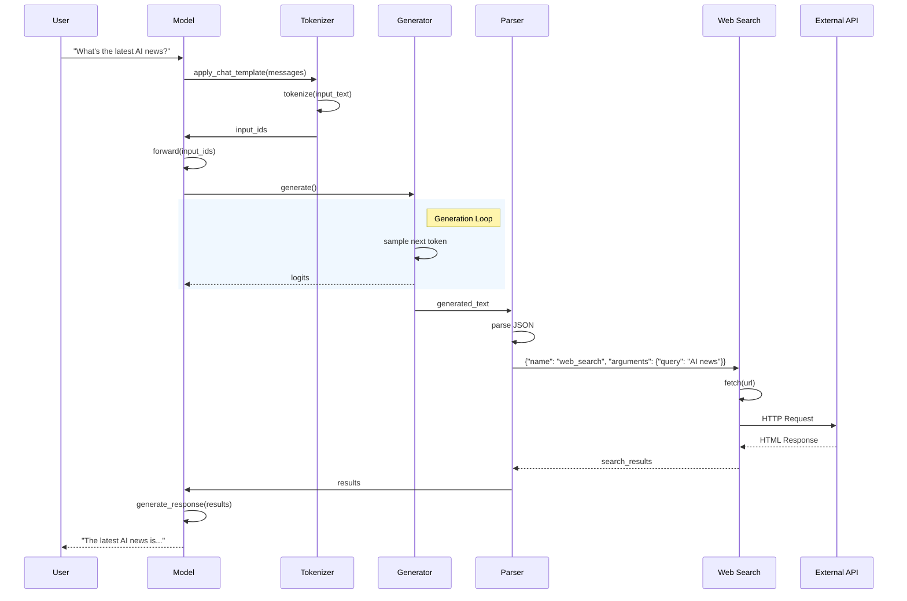
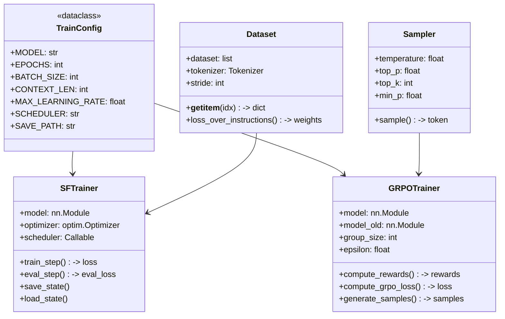
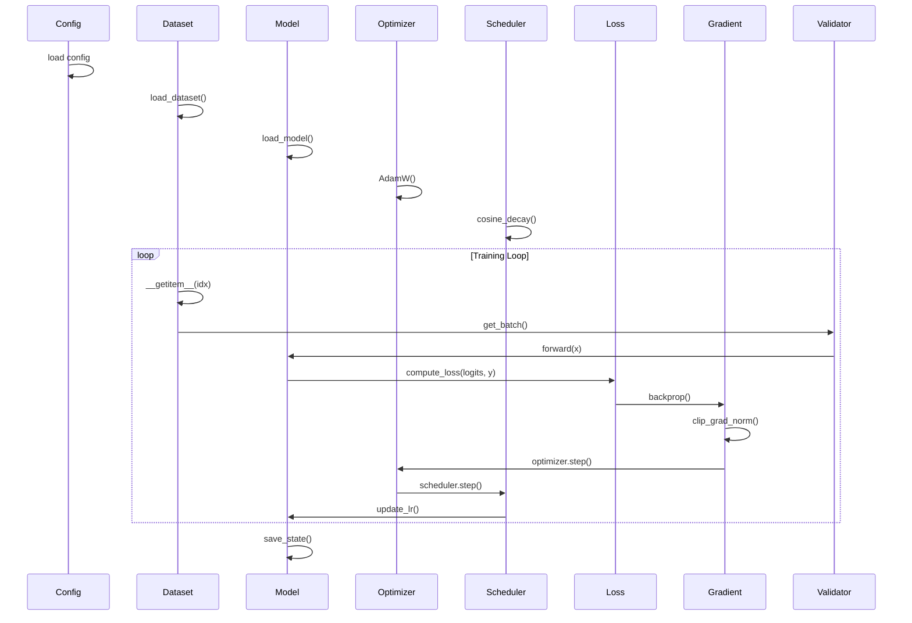
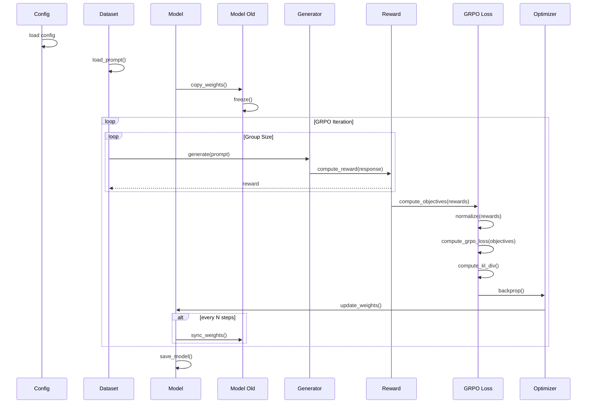
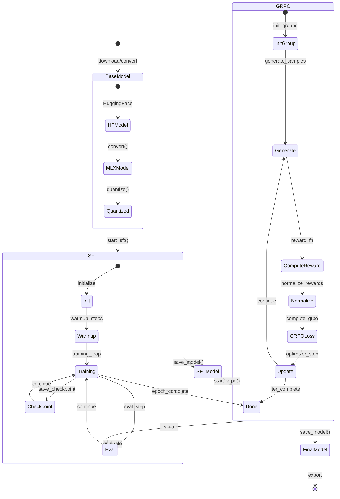
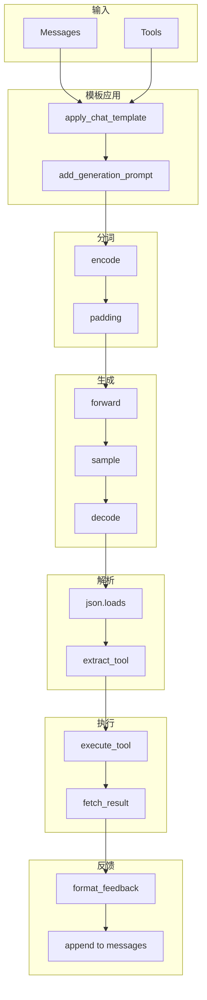

# NanoAgent 系统架构分析

## 阶段 2：Mermaid  diagrams

---

## 2.1 组件交互图

---

## 2.2 数据流图

---

## 2.3 序列图：工具调用流程

---

## 2.4 类图：训练模块

---

## 2.5 序列图：SFT 训练流程

---

## 2.6 序列图：GRPO 训练流程

---

## 2.7 状态机：模型生命周期

---

## 2.8 数据流：推理管道

---

*Generated by code-insight skill*