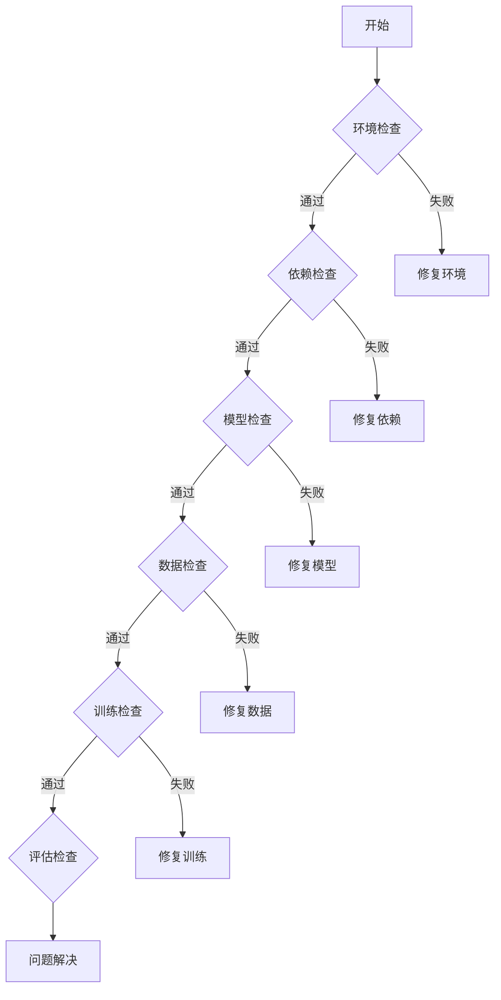

# NanoAgent 系统架构分析

## 阶段 7：模块问题排查步骤，可执行清单

---

## 7.1 问题排查流程

### 7.1.1 基础检查清单



### 7.1.2 问题定位表

| 模块 | 常见问题 | 排查命令 |
|------|---------|---------|
| 环境 | Python 版本不对 | `python --version` |
| 依赖 | mlx 安装失败 | `pip list \| grep mlx` |
| 模型 | 模型加载失败 | `ls weights/` |
| 数据 | 数据格式错误 | `head data.jsonl` |
| 训练 | loss 不收敛 | 查看日志 |
| 推理 | 输出为空 | 调试推理 |

---

## 7.2 模块检查清单

### 7.2.1 环境检查

```bash
# 检查 Python 版本
python --version
# 期望: Python 3.9+

# 检查依赖
pip list | grep -E "mlx|transformers|datasets"

# 检查 MLX
python -c "import mlx; print(mlx.__version__)"
# 期望: 0.x.x
```

### 7.2.2 模型检查

```bash
# 检查模型文件
ls -la weights/

# 检查模型格式
python -c "from mlx_lm import load; load('weights/model')"
# 期望: 成功加载

# 检查 tokenizer
python -c "from utils.tokenizer import get_tokenizer; t = get_tokenizer('HuggingFaceTB/SmolLM2-135M'); print(t.eos_token_id)"
# 期望: 2
```

### 7.2.3 数据检查

```bash
# 检查数据格式
head -n 1 data/datasets/train.jsonl | python -m json.tool

# 检查数据数量
wc -l data/datasets/*.jsonl

# 检查数据分布
python -c "
import json
with open('data/datasets/train.jsonl') as f:
    ds = [json.loads(l) for l in f]
    print(f'Total: {len(ds)}')
    print(f'Avg len: {sum(len(d[\"messages\"]) for d in ds) / len(ds)}')
"
```

### 7.2.4 训练检查

```bash
# 检查配置
python -c "
from sft.train_mlx import TrainConfig
print(TrainConfig.MODEL)
print(TrainConfig.MAX_LEARNING_RATE)
"

# 检查梯度
python -c "
import mlx.core as mx
# 在训练循环中检查梯度
print(mx.get_active_memory() / 1024 / 1024)
"
```

### 7.2.5 推理检查

```python
# 测试推理
from transformers import AutoModelForCausalLM, AutoTokenizer

model = AutoModelForCausalLM.from_pretrained("weights/model")
tokenizer = AutoTokenizer.from_pretrained("weights/model")

messages = [{"role": "user", "content": "Hi"}]
input_text = tokenizer.apply_chat_template(messages, tokenize=False, add_generation_prompt=True)
inputs = tokenizer.encode(input_text, return_tensors="pt")

outputs = model.generate(inputs, max_new_tokens=256, do_sample=False)
response = tokenizer.decode(outputs[0][inputs.shape[1]:])
print(f"Response: {response}")
```

---

## 7.3 常见问题排查

### 7.3.1 模型加载失败

**错误信息**：
```
OSError: weights/model not found
```

**排查步骤**：
1. 检查模型路径是否存在
   ```bash
   ls -la weights/
   ```
2. 检查模型格式是否正确
   ```bash
   file weights/model/*.safetensors
   ```
3. 重新下载模型
   ```bash
   python -c "from mlx_lm.utils import convert; convert('HuggingFaceTB/SmolLM2-135M', 'weights/SmolLM2-135M')"
   ```

### 7.3.2 训练 loss 不下降

**错误信息**：
```
TL 2.4532|0.0001 / EL 2.4234|0.0001
```

**排查步骤**：
1. 检查学习率是否为 0
   ```python
   print(optimizer.learning_rate.item())
   ```
2. 检查数据是否正确
   ```python
   print(dataset[0])
   ```
3. 检查梯度是否更新
   ```python
   print(model.layers[0].attention.query.weight.data)
   ```

### 7.3.3 工具调用失败

**错误信息**：
```
模型输出: "I don't know"
期望输出: [{"name": "tool_name", ...}]
```

**排查步骤**：
1. 检查 prompt 模板
   ```python
   print(TOOL_TEMPLATE)
   ```
2. 检查工具定义
   ```python
   print(json.dumps(tools, indent=2))
   ```
3. 降低 temperature
   ```python
   do_sample=False  # 使用 greedy decoding
   ```

### 7.3.4 显存不足

**错误信息**：
```
MemoryError: ...
```

**排查步骤**：
1. 检查当前内存使用
   ```python
   import mlx.core as mx
   print(f"Active: {mx.get_active_memory() / 1024 / 1024:.2f} MB")
   ```
2. 启用梯度检查点
   ```python
   for layer in model.layers[:6]:
       grad_checkpoint(layer)
   ```
3. 减小上下文长度
   ```python
   CONTEXT_LEN = 1024  # 从 2048 减小
   ```

### 7.3.5 输出格式错误

**错误信息**：
```
模型输出: "Some text"
期望输出: ```json\n[{"name": ...}]\n```
```

**排查步骤**：
1. 检查 prompt 是否包含格式要求
   ```python
   print(system_prompt)
   ```
2. 添加格式示例
   ```python
   messages = [
       {"role": "system", "content": SYSTEM_PROMPT},
       {"role": "user", "content": "..."},
       {"role": "assistant", "content": "```json\n[{"name": "example", ...}]```"},
   ]
   ```
3. 使用更低的 temperature
   ```python
   temperature=0.1
   ```

---

## 7.4 可执行排查清单

### 7.4.1 环境排查清单

- [ ] Python 版本 >= 3.9
- [ ] pip 依赖已安装
- [ ] MLX 已正确安装
- [ ] transformers 已安装
- [ ] datasets 已安装

### 7.4.2 模型排查清单

- [ ] 模型文件存在
- [ ] tokenizer 加载成功
- [ ] eos_token_id 正确 (2)
- [ ] pad_token_id 正确 (0)
- [ ] chat_template 正确

### 7.4.3 数据排查清单

- [ ] 训练数据格式正确
- [ ] 测试数据格式正确
- [ ] 数据量足够
- [ ] 数据已去重
- [ ] 数据已格式化

### 7.4.4 训练排查清单

- [ ] 学习率设置正确
- [ ] 梯度检查点已启用（如需要）
- [ ] 梯度裁剪已启用
- [ ] 保存检查点成功
- [ ] 训练 loss 下降

### 7.4.5 推理排查清单

- [ ] 模型加载成功
- [ ] 输入格式化正确
- [ ] 输出格式正确
- [ ] 工具调用正确
- [ ] 结果解析正确

---

## 7.5 快速修复命令

### 7.5.1 重新安装依赖

```bash
pip install -r requirements.txt
```

### 7.5.2 重新转换模型

```bash
python -c "
from mlx_lm.utils import convert
convert('HuggingFaceTB/SmolLM2-135M', 'weights/SmolLM2-135M')
"
```

### 7.5.3 重新准备数据

```bash
python data/dataprep.py
```

### 7.5.4 重新训练

```bash
python sft/train-mlx.py
```

### 7.5.5 重新评估

```bash
python benchmarks/bfcl/bfcl_eval.py --model_path weights/model
```

---

*Generated by code-insight skill*